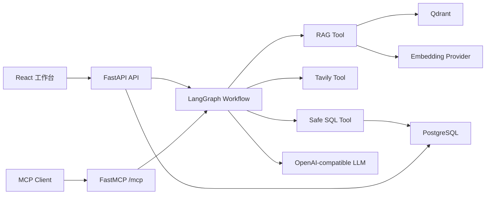

# ResearchFlow Agent

面向论文与技术资料的可溯源研究工作流 Agent。它不是一个只会聊天的壳，而是一套可以上传论文、检索页码级证据、查询实验指标、联网研究、记录工具轨迹并通过 MCP 对外提供能力的完整应用。

## 能力

- 文本型 PDF 上传、去重、后台解析与处理状态。
- 页面内 token chunk、OpenAI 兼容 Embedding、Qdrant 向量检索。
- 每条论文引用包含论文、页码、chunk ID、证据片段与相似度。
- OpenAI Function Calling 工具选择与 LangGraph 可控工作流。
- Tavily 联网搜索；无密钥时自动禁用，不影响论文问答。
- CSV 实验指标导入与只读 SQL 查询防护。
- React 研究工作台、SSE 流式响应、引用与工具轨迹侧栏。
- MCP Streamable HTTP 与 stdio 两种入口。
- PostgreSQL/Qdrant/Docker Compose 生产形态，以及 SQLite/内存向量/Fake LLM 零成本学习形态。

## 架构



LangGraph 执行顺序为：

```text
Intent Router
  -> RAG Node
  -> Web Search Node
  -> SQL Query Node
  -> Answer Synthesis Node
  -> Citation Check Node
```

每个节点只在路由命中时执行。模型负责选择工具和综合答案，程序负责权限、参数校验、检索、SQL 安全和引用真实性。

## 快速启动

### 本地学习模式

本模式不需要模型密钥、PostgreSQL、Qdrant 或 Docker。

```powershell
cd researchflow-agent
python -m venv .venv
.\.venv\Scripts\Activate.ps1
python -m pip install -e ".[dev]"
Copy-Item .env.example .env
uvicorn app.main:app --app-dir backend --reload
```

另开终端：

```powershell
cd researchflow-agent\frontend
npm install
npm run dev
```

打开 `http://localhost:5173`。API 文档位于 `http://localhost:8000/docs`。

### Docker Compose

安装 Docker Desktop 后：

```powershell
Copy-Item .env.example .env
docker compose up --build
```

打开 `http://localhost:8080`。Compose 使用 PostgreSQL 和 Qdrant，默认仍使用 Fake LLM。

## 接入真实模型

编辑 `.env`：

```dotenv
LLM_MODE=openai_compatible
CHAT_API_KEY=...
CHAT_BASE_URL=https://api.openai.com/v1
CHAT_MODEL=gpt-4.1-mini

EMBEDDING_API_KEY=...
EMBEDDING_BASE_URL=https://api.openai.com/v1
EMBEDDING_MODEL=text-embedding-3-small
```

Chat 与 Embedding 独立配置，因此可以将 DeepSeek 用作 Chat，同时将通义、OpenAI 或其他兼容服务用于 Embedding。切换 Embedding 模型后应清空旧向量卷并重新上传论文，避免维度不一致。

联网搜索只需设置：

```dotenv
TAVILY_API_KEY=...
```

## 核心接口

| 方法 | 路径 | 作用 |
|---|---|---|
| POST | `/api/v1/papers` | 上传 PDF，返回论文与任务 ID |
| GET | `/api/v1/ingestion-jobs/{id}` | 查询摄取进度 |
| POST | `/api/v1/chat` | 完整研究回答 |
| POST | `/api/v1/chat/stream` | SSE 流式研究回答 |
| POST | `/api/v1/papers/{id}/metrics/import` | 导入实验指标 CSV |
| GET | `/api/v1/conversations/{id}` | 会话和工具轨迹 |
| POST | `/mcp` | MCP Streamable HTTP |

SSE 事件包括 `run.started`、`node.completed`、`tool.completed`、`citation`、`token`、`run.completed` 和 `run.failed`。

## MCP

HTTP 客户端连接：

```text
http://localhost:8000/mcp
```

Inspector：

```powershell
npx -y @modelcontextprotocol/inspector
```

stdio：

```powershell
researchflow-mcp
```

MCP 工具为 `search_papers`、`ask_paper`、`query_experiment_metrics` 和 `get_citations`。

## 实验指标 CSV

必填列：

```text
experiment,metric_name,metric_value
```

可选列为 `unit`、`split`、`notes`。示例见 `demo/experiment_metrics.csv`。

## 质量检查

```powershell
pytest
ruff check backend
mypy backend/app

cd frontend
npm test
npm run lint
npm run build
```

## 学习

从 [学习路线](docs/learning/README.md) 开始。每个阶段都列出了对应代码、运行结果、练习与面试检查点。建议按顺序阅读，不要先钻进 LangGraph；先把 HTTP、Provider、摄取和 Tool Calling 跑通，工作流自然会变得清楚。

